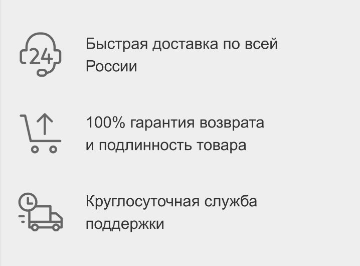

### HTML and CSS practice
[Пример](https://leonidfeskov.github.io/html-and-css-practice/)

[Макет](https://www.figma.com/file/15m1YmCgsCF85PObn0lQaQ/%D0%A1%D0%BA%D0%B2%D0%BE%D0%B7%D0%BD%D0%B0%D1%8F-%D0%B4%D0%BE%D0%BC%D0%B0%D1%88%D0%BA%D0%B0?node-id=91%3A999)

## Установка
* Установите [Node.js](https://nodejs.org/en/download/)
`brew install node`
* Установите [yarn](https://yarnpkg.com/lang/en/docs/install/) 
`npm install --global yarn`
* Перейдите в папку с проектом и установите js-зависимости
`yarn install`

## Запуск локального сервера для разработки:
`yarn start`

откройте [http://localhost:1234/](http://localhost:1234/)

## ДЗ. Что надо сделать
* Сверстать 2 блока [Макет](https://www.figma.com/file/15m1YmCgsCF85PObn0lQaQ/%D0%A1%D0%BA%D0%B2%D0%BE%D0%B7%D0%BD%D0%B0%D1%8F-%D0%B4%D0%BE%D0%BC%D0%B0%D1%88%D0%BA%D0%B0?node-id=91%3A999)

1 | 2 |
--- | ---
|

* Не забыть про адаптив
* Срок – до 25.01.2022 включительно

## Как делать
* Скопировать данный репозиторий, например с помощью [github import](https://github.com/new/import)
* Создать новую ветку `git switch -c BRANCH_NAME`]
* Сделать домашнее задание, пушнуть в ветку `BRANCH_NAME`
* Создать пулреквест на github
* Выполнить `yarn deploy` из папки со своим проектом для публикации верстки на gh-pages
* Проверить, что верстка доступна по адресу `https://USER_NAME.github.io/REPO_NAME/`
* Прислать ссылку на пулреквест мне в личку в slack (Феськов Леонид)

## Критерии оценки
* Срок сдачи
* Качество выполнения
* Стиль кода
